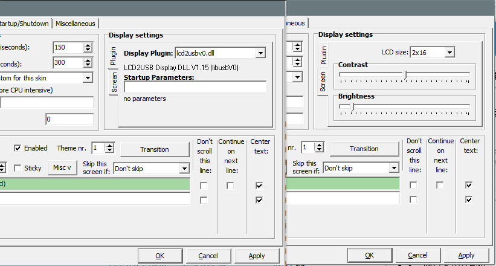

title: LCD2USB使用说明
category: 教程
time: 1524827513376

---

# LCD2USB使用说明

## 硬件

- 显示屏左右两个USB口可用于供电及传输数据的，两个USB口功能完全相同，可以随意使用。
- 背面的右上角有一个电位器，可用于调节液晶屏的对比度。
- 背面的右下角有三个按钮，用于时钟模式下的调节。
- 显示屏和底板之间有一个按钮，按住这个按钮并连接电脑可更新固件。

## LCD2USB模式

LCD2USB可以连接电脑作为状态显示器使用。

### 安装驱动

连上电脑后，电脑会提示发现了一个新设备“LCD2USB Interface”。下载[zadig](http://zadig.akeo.ie/downloads/zadig.exe)并打开，点击“Options”，勾上“List All Devices”选项，然后在下面的下拉框中选择设备“LCD2USB Interface”。将Driver右边的框由“WinUSB”改为“libusb-win32”，点击“Replace Driver”，驱动即安装完成。

### 使用 AIDA64 作为显示控制器

AIDA64是一款系统信息查看工具，它支持将系统信息输出至LCD2USB设备。如果你不想使用AIDA64，可以看下面的章节。

打开AIDA64，选择“文件-设置”，在左边展开“硬件监视工具”，选择"LCD"。在右边的面板中点击“LCD2USB”，勾上“启用 LCD2USB LCD 支持”，将LCD类型改为16x2。接着，你可以在左边的"LCD选项"中更改你要显示的内容。

### 使用 LCD Smartie 作为显示控制器

LCD Smartie是一个专门用于LCD显示的工具。你可以下载[官方版本](https://sourceforge.net/projects/lcdsmartie/files/lcdsmartie/5.4.2.92%2B%2B/LCD_Smartie_v5.4.2.92%2B%2B.zip/download)亦或者是去下载汉化版本。下载完成后解压，检查"displays"文件夹里面是否含有"lcd2usb.dll"。如果没有，请下载[LCD2USB.dll](https://github.com/harbaum/LCD2USB/raw/master/contrib/LCD2USB.dll)并放入displays文件夹。

运行LCDSmartie，点击左下角的Setup，在“Display Settings”里面点击“Plugins”，将“Display Plugin”改为“LCD2USB.dll”（或“lcd2usbv0.dll”）；然后选择“Screen”，将“LCD Size”改为“16x2”。点击OK后关闭软件再重新打开，即可看到屏幕上正常显示了。

## 时钟模式

若不使用LCD2USB的软件控制，则默认时钟模式。

### 时间显示页面

- 按下任意按键可以在屏幕背光熄灭时点亮屏幕背光。
- 短按P键则可以强制刷新温度测量值。
- 长按P键进入可以进入设置菜单。

### 菜单页面

进入菜单后可以使用+-键选择子菜单，短按P键进入子菜单，长按P键退出菜单。

进入子菜单后使用+-键调整当前光标指示的数值，短按P键确认并移动光标，长按P键不保存并退出子菜单。

- Date：调整日期
- Time：调整时间
- Temp. Offset：调整温度偏移，用于校正温度计。长按P键可以重置校正值。
- Light Level：调整背光亮度。
- Light Auto Off：调整背光自动关闭的时段。背光在这个时间段内会在5秒后自动关闭。

## 更新固件

下载固件文件与[固件更新工具](http://wch.cn/download/WCHISPTool_Setup_exe.html)，打开固件更新工具，选择“8位CH55X系列”，芯片型号选择“CH552”，用户程序文件选择刚刚下载好的固件文件。将LCD2USB从电脑断开，按住液晶屏后方的按钮并将LCD2USB连上电脑，然后松开按钮。这时，USB设备列表会出现一个设备，点击“下载”即可。

更新完成后若LCD2USB没有恢复正常工作，可以将LCD2USB从电脑上断开并重新连接。

## 故障排除

- 字体暗淡或者字体背景太深，对比度不正确：

  > 使用螺丝刀调整LCD2USB背部右上角的电位器，使对比度正确。

- 断开电源后时间无法正常保存：

  > 将屏幕模块与控制模块（底板）小心的分开，更换底板上的后备电池。

